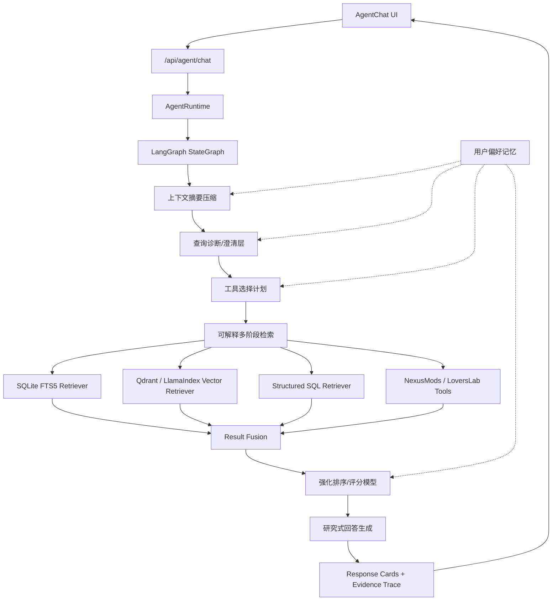

# Agent 多步检索与 LangGraph/LlamaIndex 技术方案

## 目标

将当前 Agent 从“单轮查询计划 + 搜索 + 回答”升级为可解释、多阶段、可评测的多步 Agent。LangGraph 用于多步状态机、上下文状态、checkpoint 和恢复；LlamaIndex 用于 retriever/query engine 抽象；本项目继续负责硬过滤、安全边界、设置、持久化、外部站点适配和前端 API 契约。

## 总体架构



## 技术选型

| 能力 | 开源项目/组件 | 用途 |
| --- | --- | --- |
| 多步 Agent 编排 | LangGraph StateGraph | 表达 analyze -> summarize_context -> clarify -> retrieve -> rerank -> reflect -> answer 的状态流 |
| 状态持久化 | LangGraph checkpoint / persistence | 保存图状态，支持多轮上下文、恢复、调试和中断 |
| 检索抽象 | LlamaIndex Retriever / Query Engine | 统一本地 FTS、结构化 SQL、Qdrant、在线工具的接口 |
| 关键词召回 | SQLite FTS5 | 替换粗粒度 ilike，提供全文索引和 BM25 排名 |
| 语义召回 | Qdrant + LlamaIndex VectorStoreIndex | 支持中文/英文模糊语义、摘要语义匹配和 metadata filter |
| 本地重排 | sentence-transformers CrossEncoder | 对 top 30-50 候选做 query-document 相关性重排 |
| 结果融合 | Reciprocal Rank Fusion / 自研 fusion | 合并 FTS、向量、SQL、在线结果 |
| 质量评测 | pytest + LlamaIndex evaluation 思路 | 固化 Agent 质量回归集 |

## 设计原则

- LLM 可以辅助理解、规划、解释和总结，但不能决定硬过滤结果。
- `game`、`source`、`adult_content`、`ignored` 等硬约束必须由代码、SQL 或 metadata filter 保证。
- LangGraph 不直接接管 FastAPI、SQLModel、settings、local-only 限制、NexusMods/LoversLab adapter；它只负责编排和状态流转。
- LlamaIndex 不直接接管业务流程；它只作为 retriever/query engine 抽象层。
- 在线工具结果先规范化/upsert，再进入统一结果结构，保持前端详情接口一致。
- 每次放宽约束必须记录到 trace 和 response cards，避免用户感觉 Agent 在乱搜。
- Qdrant、CrossEncoder 等增强能力必须可关闭，普通用户启动应用不能强依赖额外服务。

## 状态所有权

引入 LangGraph checkpoint 后，必须避免出现两套会话事实源。

- `agent_messages` 和现有 `conversation_service` 继续作为用户可见会话的唯一事实源，负责消息、结果卡片、`llm_provider`、`llm_model`、`response_cards_json` 和 `client_updated_at` 陈旧写入保护。
- LangGraph checkpoint 只保存单次 Agent 运行或可恢复多步流程的临时图状态，例如当前节点、工具 trace、反思结果、未完成动作和压缩上下文。
- 一次图执行完成后，只把可公开结果、response cards、matches、trace summary 回写到现有会话状态。
- 如果 LangGraph checkpoint 与 `agent_messages` 不一致，以 `agent_messages` 为准；checkpoint 应丢弃或重建。
- 长期用户偏好仍由 `memory/` 服务持久化，不放在 LangGraph checkpoint 中作为唯一来源。
- 记忆读取、写回和冲突证据由 `memory/evidence_service.py` 转换为可审计 fragments；runtime 只决定何时写回和何时把证据挂到响应上。

## 运行模式

普通用户启动路径必须保持轻量，增强能力按 profile 分层启用。

| 模式 | 默认能力 | 可选依赖 |
| --- | --- | --- |
| Core | 现有 SQL 检索、SQLite FTS5、规则计划、研究式回答 | 无额外服务 |
| Enhanced | Core + CrossEncoder 本地重排 | sentence-transformers 模型缓存 |
| Semantic | Enhanced + Qdrant 语义召回 | Qdrant 本地服务或嵌入式实例 |
| Agent Pro | Semantic + LangGraph 状态图、AgentSkill、反思节点 | LangGraph/LlamaIndex 相关依赖 |

所有 profile 都必须支持缺失依赖自动降级，并在 trace 中说明降级原因。

## 模块规划

```text
backend/app/services/agent/
  runtime.py
  chat_service.py

  planning/
    query_diagnosis.py
    tool_planner.py
    parallel_executor.py
    query_planner.py

  workflows/
    mod_search_graph.py
    graph_state.py

  context/
    context_summarizer.py
    context_window.py
    context_store.py

  reflection/
    audit_service.py
    response_enrichment.py
    reflection_service.py
    plan_critic.py
    result_critic.py
    answer_critic.py

  skills/
    skill_registry.py
    skill_router.py
    skill_executor.py
    builtin/
      mod_research_skill.py
      compatibility_check_skill.py
      install_risk_skill.py

  retrievers/
    structured_sql_retriever.py
    sqlite_fts_retriever.py
    qdrant_retriever.py
    nexusmods_retriever.py
    loverslab_retriever.py

  ranking/
    fusion.py
    relevance_scorer.py
    cross_encoder_reranker.py
    llm_reranker.py

  memory/
    evidence_service.py
    preference_service.py
    preference_extractor.py
    favorite_preference_summarizer.py

  answering/
    research_answer_service.py

  tracing/
    search_trace.py
```

`chat_service.py` 逐步瘦身为入口适配层。新的 `runtime.py` 负责组装依赖、调用 workflow、返回 `AgentChatResponse`；audit 构建、推荐动作一致性校验和检索决策证据归入 `reflection/audit_service.py`，公开响应中的 understanding 补全归入 `reflection/response_enrichment.py`，避免主流程承载具体质量判断或槽位补全逻辑。

## 1. 查询诊断/澄清层

新增 `planning/query_diagnosis.py`，在检索前判断用户问题是否足够清晰。

输出结构示例：

```json
{
  "intent": "search",
  "confidence": 0.72,
  "missing_slots": ["game"],
  "known_slots": {
    "category": "outfit",
    "adult_content": true,
    "sort": "updated_at_remote"
  },
  "should_clarify": true,
  "clarifying_question": "你想看哪个游戏的成人服装 Mod？"
}
```

策略：

- 置信度低：先尝试结合上下文补全意图；上下文仍不足时再返回澄清问题，不进入检索。
- 置信度中：按假设检索，并在 response cards 中展示“我按这些条件理解”。
- 置信度高：直接进入工具选择计划。

诊断层应复用现有 `query_planner.py` 的槽位标准化能力，避免出现两套游戏、来源、成人内容判断规则。

模糊意图处理规则：

1. 如果用户输入缺少游戏、来源、分类或排序，但最近对话、last query context、当前结果卡片或收藏偏好能提供高置信补全，则优先补全并继续工作。
2. 当前会话上下文优先于长期偏好；用户最近一次明确指定的游戏、来源、成人内容和排序优先于收藏总结。
3. 显式当前输入优先级最高。用户本轮明确指定的条件必须覆盖上下文和偏好。
4. 当上下文补全存在多个冲突候选，或补全后仍会显著改变结果范围时，才向用户澄清。
5. 使用上下文补全时，response cards 应说明假设，例如“按上一轮的 Stellar Blade 继续查找”。

上下文优先级：

1. 当前用户输入中的显式条件。
2. 当前会话最近一轮用户明确条件。
3. 当前结果卡片/用户点击的 Mod 详情上下文。
4. `last_query_context`。
5. 收藏 Mod 总结出的长期偏好。
6. 系统默认值。

## 2. 上下文摘要压缩

新增 `context/` 模块，用于在多轮对话和多步 Agent 执行中压缩上下文。压缩目标不是简单缩短聊天记录，而是保留可继续工作的任务状态、用户约束、工具结果、偏好和未完成问题。

LangGraph 适合放在这一层：图状态中维护 `messages`、`running_summary`、`last_query_context`、`active_constraints`、`tool_traces`、`reflection_notes`。每轮进入检索前先运行 context summarization 节点，避免 prompt 变长、上下文漂移和多步状态丢失。

建议状态结构：

```json
{
  "messages": [],
  "running_summary": "用户最近在查 Stellar Blade 成人服装 Mod，偏好 NexusMods，排序偏最近更新。",
  "last_query_context": {
    "game": "Stellar Blade",
    "category": "outfit",
    "adult_content": true,
    "sort": "updated_at_remote"
  },
  "active_constraints": {
    "source": null,
    "adult_content": true
  },
  "tool_traces": [],
  "reflection_notes": [],
  "open_questions": []
}
```

压缩策略：

1. 最近 3-5 轮原文保留，用于处理指代、省略和语气。
2. 更早对话压缩为 `running_summary`，只保留任务相关事实：游戏、来源、分类、成人内容、排序、已尝试工具、已放宽条件、用户明确否定项。
3. 工具结果不整段塞入上下文，只保留 result ids、top candidates、trace summary 和失败原因。
4. 收藏偏好、长期偏好和会话摘要分开存储；长期偏好不能覆盖本轮显式输入。
5. 每次摘要更新都记录 `summary_updated_at` 和摘要来源，便于调试。

触发条件：

- 消息数量超过阈值，例如 12 条。
- 上下文字符数超过阈值，例如 12000 字。
- 工具 trace 过多，例如超过 20 条。
- 进入多步检索前，发现用户输入存在“继续、还是、这个、类似”等依赖上下文的指代。

约束：

- 摘要必须是结构化状态 + 简短自然语言摘要，不只是一段自由文本。
- 摘要不能丢失用户明确约束，尤其是成人内容、非成人排除、来源指定和游戏名。
- 摘要不能保存原始 chain-of-thought；只保存可审计的公开事实、约束、动作和结果。
- LangGraph checkpoint 可保存图状态，但长期偏好仍由本项目 `memory/` 服务持久化。

## 3. 可解释多阶段检索

新增 `retrieval/staged_search.py` 或在 `workflows/mod_search_graph.py` 中实现阶段调度。

推荐阶段：

1. 结构化 SQL：执行 `game/source/adult_content/ignored` 等硬过滤。
2. SQLite FTS5：查标题、作者、分类、原文摘要、译文摘要。
3. Qdrant 语义检索：处理“好看、服装、画质、随从、类似”等模糊语义。
4. 在线工具：NexusMods、LoversLab Google、LoversLab scrape。
5. 放宽重试：结果不足时按规则放宽软条件。

每个阶段记录 trace：

```json
{
  "stage": "sqlite_fts",
  "query": "stellar blade outfit dress",
  "filters": {
    "adult_content": true
  },
  "result_count": 6,
  "explanation": "使用全文索引查找标题和摘要中的服装相关词"
}
```

放宽策略示例：

- 保留游戏，放宽分类。
- 保留成人内容约束，扩展同义词。
- 本地无结果时查在线来源。
- 在线仍无结果时返回清晰解释，而不是静默退回无关结果。

## 4. 强化排序/评分模型

新增 `ranking/relevance_scorer.py` 和 `ranking/fusion.py`。结果不再只有一个整数 `score`，而是拆分为可解释分数。

示例：

```json
{
  "final_score": 0.86,
  "components": {
    "keyword_score": 0.21,
    "semantic_score": 0.28,
    "freshness_score": 0.12,
    "popularity_score": 0.09,
    "preference_score": 0.08,
    "source_confidence": 0.08
  },
  "rank_reason": "匹配 Stellar Blade、成人内容、服装语义，并且更新时间较近"
}
```

推荐排序链路：

1. SQLite FTS5 BM25 提供关键词召回分。
2. Qdrant 提供语义召回分。
3. Structured SQL 提供硬约束命中和业务排序分。
4. Reciprocal Rank Fusion 合并多路结果。
5. CrossEncoder 对 top 30-50 做本地重排。
6. LLM rerank 只在本地重排置信度低或用户问题复杂时启用。

## 5. 用户偏好记忆

新增 `memory/preference_service.py` 和 `memory/preference_extractor.py`。当前会话记录只保存消息，后续需要抽取长期偏好。

建议保存：

```json
{
  "preferred_games": ["Stellar Blade", "Skyrim Special Edition"],
  "preferred_sources": ["nexusmods", "loverslab"],
  "adult_content_preference": true,
  "adult_content_preference_confidence": 0.86,
  "sort_preference": "updated_at_remote",
  "category_preferences": ["outfit", "visual"],
  "favorite_summary": {
    "top_games": ["Stellar Blade"],
    "top_categories": ["outfit", "visual"],
    "top_sources": ["nexusmods"],
    "adult_content_ratio": 0.62,
    "summary": "用户收藏偏向 Stellar Blade 的服装和视觉类 Mod，且较常收藏成人内容。"
  },
  "last_query_context": {
    "game": "Stellar Blade",
    "category": "outfit",
    "source": "nexusmods"
  }
}
```

使用规则：

- 用户说“继续找这个游戏的最新服装”，继承上一轮 `game/category`。
- 用户经常看 NexusMods，工具计划优先本地 + NexusMods。
- 成人内容默认过滤；如果用户当前输入明确包含成人/R18/NSFW，则只看成人内容。
- 如果用户收藏中存在一定量成人内容，达到配置阈值后默认允许成人内容进入结果，但不强制只看成人内容。
- 历史查询多次明确选择成人内容也可以作为辅助信号，但收藏 Mod 是更高优先级的偏好来源。
- 如果用户明确说非成人/SFW/排除成人，则必须过滤成人内容，并覆盖任何历史偏好。
- 定期或按需分析用户收藏 Mod，统计收藏中的游戏、来源、分类、成人内容比例、常见关键词和更新时间偏好，作为长期偏好的高置信度来源。
- 收藏偏好只影响软排序和默认假设；当用户显式指定游戏、来源、成人内容或排序时，用户当前输入优先。
- 前端应提供查看/清除 Agent 偏好的入口，避免不可见记忆影响结果。

成人内容过滤优先级：

1. 用户当前输入显式排除成人内容：`adult_content=false`，必须过滤成人内容。
2. 用户当前输入显式请求成人内容：`adult_content=true`，只返回成人内容。
3. 用户收藏成人内容达到配置阈值：`adult_content=null` 且 `adult_content_allowed=true`，允许成人内容和非成人内容共同参与召回与排序。
4. 无明确输入且无高置信偏好：`adult_content=false`，默认过滤成人内容。

实现上要区分两个字段：`adult_content` 表示硬过滤三态，`adult_content_allowed` 表示默认是否允许成人内容混入结果。收藏成人内容偏好必须由代码计算，示例阈值：收藏成人内容数量 >= 5，或收藏成人内容比例 >= 0.35 且收藏样本数 >= 8。历史查询可作为辅助阈值，例如最近 10 次 Agent 查询中成人内容显式请求占比 >= 0.5。阈值应放入 settings，便于后续调整。

收藏总结流程：

1. `favorite_preference_summarizer.py` 从收藏表读取 Mod 元数据和摘要。
2. 用确定性统计得到 top games、top sources、top categories、adult content ratio。
3. 可选调用 LLM 生成一句自然语言偏好摘要，但结构化偏好必须来自代码统计。
4. 将结果写入偏好存储，并记录 `favorite_summary_updated_at`，避免每次对话重复扫描。
5. 收藏新增、删除、导入后标记偏好摘要失效，由后台任务或下一次 Agent 请求增量刷新。

## 6. 工具选择计划

新增 `planning/tool_planner.py`。它根据查询诊断、用户偏好、可用 API key、local-only 策略生成工具计划。

示例：

```json
{
  "steps": [
    {
      "tool": "structured_sql",
      "reason": "先用硬过滤查本地缓存"
    },
    {
      "tool": "sqlite_fts",
      "reason": "用户包含具体关键词和分类语义"
    },
    {
      "tool": "qdrant_vector",
      "reason": "服装/好看属于模糊语义需求"
    },
    {
      "tool": "nexusmods_search",
      "group": "online",
      "reason": "用户偏好 NexusMods 且已配置 API key"
    }
  ],
  "fallback_steps": [
    {
      "tool": "loverslab_google",
      "group": "online",
      "reason": "成人内容在 LoversLab 可能有更多结果"
    }
  ],
  "parallel_groups": [
    {
      "name": "local_retrieval",
      "tools": ["structured_sql", "sqlite_fts", "qdrant_vector"],
      "max_concurrency": 3,
      "timeout_ms": 2500,
      "required_before": "fusion"
    },
    {
      "name": "online_retrieval",
      "tools": ["nexusmods_search", "loverslab_google"],
      "max_concurrency": 2,
      "timeout_ms": 6000,
      "run_when": "local_results_below_threshold"
    }
  ]
}
```

约束：

- LLM 可以建议工具，但代码必须校验工具白名单、API key、local-only 策略。
- 工具计划要进入 trace 和 response cards。
- 不允许 LLM 生成任意 SQL 或任意 URL 请求。
- 无依赖的检索工具应按 `parallel_groups` 并发执行，降低总延迟；有依赖的步骤，例如放宽重试、结果融合、重排和回答生成，仍按顺序执行。
- 并发执行器必须为每个工具设置超时、异常隔离和部分失败降级。一个在线工具失败不能影响本地结果返回。
- 并发结果进入统一 fusion 层，不能由先返回的工具直接决定最终排序。
- 对外部站点工具设置独立并发上限，避免触发 NexusMods/LoversLab/Google 的速率限制。

并发执行模型：

1. `tool_planner.py` 输出带依赖关系的 DAG 或分组计划。
2. `parallel_executor.py` 使用 `asyncio.gather(..., return_exceptions=True)` 或 LangGraph 并发节点执行同组工具。
3. 每个工具返回 `ToolExecutionResult`，包含 `status`、`duration_ms`、`result_count`、`error_type`、`trace`。
4. fusion 层只消费成功和可降级的结果，失败信息进入 trace 和 response cards。
5. 如果本地并发组已经达到足够结果数，在线并发组可跳过或延后，减少等待时间。

## 7. 研究式回答生成

新增 `answering/research_answer_service.py`，逐步替代当前偏列表转述的回答方式。

建议回答结构：

```text
结论：
最推荐 A、B、C。

为什么推荐：
- A：匹配 Stellar Blade + 成人服装，更新时间最近。
- B：下载量更高，但更新时间稍旧。
- C：来自 LoversLab，成人内容匹配度高。

检索过程：
我先查了本地缓存，然后用全文检索扩展 outfit/clothing/dress，最后补查 NexusMods。

注意点：
这些结果里有成人内容；安装前建议确认前置依赖和版本兼容。

下一步：
可以继续按下载量、更新时间、安装风险或只看 NexusMods 过滤。
```

可以先通过 `response_cards` 承载 `rank_reason`、`matched_terms`、`retrieval_sources`、`score_breakdown`，避免第一阶段立刻破坏前端类型。

## 8. AgentSkill 支持

新增 `skills/` 模块，用于把常见高层任务封装成可注册、可路由、可组合的应用内 `AgentSkill`。这里的 AgentSkill 不等同于 Codex/插件系统里的 skill；它是本应用 Agent 的任务能力单元，内部可以调用多个工具、retriever、reranker 和回答服务。

建议内置 AgentSkill：

- `mod_research_skill`：围绕某个游戏/类别做综合检索、排序和研究式总结。
- `compatibility_check_skill`：根据 Mod 元数据、摘要、版本、来源和历史结果分析兼容性风险。
- `install_risk_skill`：总结安装风险、前置依赖、成人内容、来源可信度和版本注意事项。
- `similar_mod_skill`：基于当前候选结果寻找相似 Mod。
- `preference_summary_skill`：根据收藏和历史查询总结用户偏好。

AgentSkill 定义示例：

```json
{
  "name": "mod_research",
  "description": "对用户指定的 Mod 需求进行多阶段检索、重排和研究式总结",
  "triggers": ["找", "推荐", "research", "类似", "最近更新"],
  "required_slots": ["query"],
  "optional_slots": ["game", "source", "adult_content", "sort"],
  "allowed_tools": ["structured_sql", "sqlite_fts", "qdrant_vector", "nexusmods_search", "loverslab_google"],
  "can_run_in_parallel": false,
  "output_contract": "AgentSkillResult"
}
```

AgentSkill 路由规则：

1. `query_diagnosis.py` 识别 intent 和缺失槽位。
2. `skill_router.py` 根据 intent、用户输入、当前会话上下文、收藏偏好选择一个或多个候选 AgentSkill。
3. `skill_registry.py` 校验 AgentSkill 是否启用、是否满足 local-only、安全策略和依赖能力。
4. `skill_executor.py` 执行 AgentSkill。AgentSkill 内部可以调用 `tool_planner.py` 生成工具计划，也可以直接声明固定工具 DAG。
5. AgentSkill 输出统一为 `AgentSkillResult`，包含 `answer_payload`、`matches`、`trace`、`confidence`、`followup_questions`。

约束：

- AgentSkill 必须声明 `allowed_tools`，不能绕过工具白名单。
- AgentSkill 不能直接访问任意文件、任意 URL 或任意 SQL；所有外部访问必须通过已有 service/tool。
- AgentSkill 可以并发执行，但必须通过 `parallel_executor.py` 统一管理超时、失败降级和 trace。
- AgentSkill 的触发结果必须可解释，response cards 应展示“使用了哪个 AgentSkill”以及为什么使用。
- AgentSkill 可作为 LangGraph 节点，也可以包装为 LlamaIndex Tool 供检索/查询层复用，但执行边界仍由本项目控制。

AgentSkill 与工具计划的关系：

- Tool 是低层动作，例如 FTS 检索、Qdrant 检索、NexusMods 查询。
- AgentSkill 是高层任务，例如“研究某类 Mod”“分析安装风险”“找相似 Mod”。
- 一个 AgentSkill 可以生成并执行多个工具计划。
- 多个互不依赖的 AgentSkill 可以并发运行，例如同时生成“推荐列表”和“安装风险摘要”；最终由回答层融合。

## 9. Agent 自我思考与自检

新增 `reflection/` 模块，用于让 Agent 在关键阶段进行内部自检、计划修正和结果质量评估。这里的“自我思考”不等于向用户展示原始推理链；对外只展示简洁、可审计的结论、依据和修正动作。

自检节点：

1. `plan_critic.py`：检查 query diagnosis、skill routing、tool plan 是否完整，是否缺少必要槽位，是否违反 local-only、成人内容过滤、工具白名单等规则。
2. `result_critic.py`：检查召回结果是否足够、是否和用户问题相关、是否被过度放宽、是否需要补充在线检索或澄清。
3. `answer_critic.py`：检查回答是否基于候选结果、是否编造未提供信息、是否遗漏成人内容/安装风险/放宽动作说明。
4. `audit_service.py`：构建 `analysis -> evidence -> conclusion` 审计对象，校验推荐动作和证据的一致性。
5. `response_enrichment.py`：把查询诊断、query plan 和候选结果同步到公开 `understanding`，保持 response/audit slot 一致。
6. `reflection_service.py`：统一执行自检策略，并把可公开的自检摘要写入 trace。

自检输出示例：

```json
{
  "stage": "result_critic",
  "confidence": 0.64,
  "issues": [
    "本地结果不足 3 条",
    "服装分类过滤可能过窄"
  ],
  "actions": [
    {
      "type": "relax_filter",
      "target": "category",
      "reason": "保留游戏和成人内容约束，放宽服装分类以扩大召回"
    },
    {
      "type": "run_tool_group",
      "target": "online_retrieval",
      "reason": "本地结果不足，补查在线来源"
    }
  ],
  "public_summary": "本地结果较少，因此保留游戏和成人内容约束，放宽分类并补查在线来源。"
}
```

触发规则：

- 工具计划生成后执行 plan critic。
- 首轮检索结果少于阈值、分数低、或结果来源单一时执行 result critic。
- 最终回答生成前执行 answer critic。
- 查询诊断判定为模糊意图时，plan critic 必须先检查是否已经利用可用上下文补全，再决定是否要求澄清。
- 用户追问“为什么推荐这些”或“你查了什么”时，回答层使用 trace 和 public summary，而不是暴露原始推理链。

约束：

- 不保存或展示原始 chain-of-thought；只保存结构化自检结果、问题列表、动作和公开摘要。
- 自检不能绕过硬规则。成人内容、ignored、local-only、工具白名单仍由代码强制。
- 自检动作必须是有限枚举，例如 `ask_clarification`、`relax_filter`、`run_tool_group`、`rerank_again`、`answer_with_limitations`。
- 自检最多重试固定次数，避免循环反思导致延迟失控。
- 所有自检动作进入 trace，便于调试和质量评测。

## 分阶段实施路线

### Phase 1：LangGraph 最小状态图骨架

- 新增 `workflows/graph_state.py`，定义第一版 `AgentGraphState`：`request`、`messages`、`active_session_id`、`last_query_context`、`query_plan`、`matches`、`response_cards`、`trace`、`errors`。
- 新增 `workflows/mod_search_graph.py`，先实现最小节点：`load_state -> run_existing_agent -> persist_result`。
- 新增 `runtime.py`，作为 `chat_service.py` 的新入口适配层；第一阶段内部仍调用现有 `AgentService` / `AgentSearchOrchestrator` / `AgentAnswerService`。
- 明确 `agent_messages` / `conversation_service` 是用户可见会话事实源；LangGraph checkpoint 只保存临时图状态。
- 不接入 Qdrant、CrossEncoder、AgentSkill、自检节点；先保证现有 `/api/agent/chat` 行为和响应 schema 不变。
- 测试 API 响应兼容、会话保存、`client_updated_at` 冲突保护、图状态最小流转和失败回退到现有 Agent 路径。

### Phase 2：Trace 与状态可观测基建

- 新增 `tracing/search_trace.py`，定义统一 `TraceEvent` / `ToolExecutionResult` / `GraphStepTrace`。
- 将现有 Local/Nexus/LoversLab 调用包装出最小 trace，不改变检索策略。
- response cards 可展示使用过的阶段、过滤条件、降级原因和耗时摘要。
- GraphState 记录 trace summary，完整 trace 可按需调试，不把内部推理链写入用户消息。
- 测试成功 trace、工具异常 trace、降级 trace、trace 写入 response cards。

### Phase 3：上下文摘要压缩与状态适配

- 新增 `context/context_summarizer.py`、`context/context_window.py`、`context/context_store.py`，并先适配现有 `conversation_service` / `history.compress_history`。
- 扩展 `AgentGraphState` 字段：`running_summary`、`active_constraints`、`tool_traces`、`reflection_notes`。
- 在进入查询诊断和检索前执行摘要压缩节点。
- 保留最近 3-5 轮原文，更早对话压缩为结构化状态和简短摘要。
- 测试长会话压缩、约束不丢失、成人/非成人约束保留、工具 trace 压缩、摘要不覆盖本轮显式输入。

### Phase 4：查询诊断与澄清

- 新增 `planning/query_diagnosis.py`。
- 复用 `normalize_query_plan()` 和现有游戏别名逻辑。
- 在 LangGraph 中新增 `diagnose_query` 节点，消费 Phase 3 产出的上下文摘要和 `last_query_context`。
- 模糊意图先结合上下文补全；上下文仍不足时才返回澄清问题。
- 增加测试：缺游戏、缺来源、低置信度、继承上下文、模糊意图优先用最近上下文补全。

### Phase 5：Core 检索改造与 SQLite FTS5

- 新增 `mods_fts` 虚表和迁移/启动修复逻辑。
- 将标题、作者、分类、原文摘要、译文摘要纳入索引。
- 新增 `retrievers/sqlite_fts_retriever.py`。
- 本地检索从 `ilike` 升级为 FTS + 结构化过滤，保持 Core 模式无额外服务依赖。
- 测试中文、英文、混合关键词、摘要命中、ignored 过滤、成人内容三态契约。

### Phase 6：多阶段检索与结果融合

- 新增 staged retrieval 节点，把结构化 SQL、SQLite FTS、现有在线工具纳入统一阶段。
- 新增 `ranking/fusion.py` 和 `ranking/relevance_scorer.py`。
- 引入 score breakdown。
- 支持结果不足时按规则放宽软条件，保留硬过滤。
- response cards 显示“为什么排在前面”。
- 保留现有 `score` 字段作为兼容输出。
- 测试本地无结果时在线查、结果不足时放宽软条件、source/external_id 去重、排序稳定性。

### Phase 7：用户偏好记忆

- 新增偏好服务和偏好抽取器。
- 新增 memory evidence service，将短期上下文、长期偏好、写回结果和记忆冲突统一归档为 evidence fragments。
- 保存长期偏好和 last query context。
- 新增收藏 Mod 偏好总结器，从收藏列表统计常见游戏、来源、分类、成人内容比例和关键词。
- 收藏新增、删除、导入后标记偏好摘要失效，下一次 Agent 请求或后台任务刷新摘要。
- query diagnosis 和 tool planner 注入偏好。
- 前端增加偏好查看/清除入口。

### Phase 8：工具选择计划与并发执行

- 新增 `planning/tool_planner.py`。
- 新增 `planning/parallel_executor.py`，支持按工具依赖和并发组执行检索工具。
- 工具白名单与可用性检查。
- 为每个工具配置超时、并发上限、失败降级和 trace 记录。
- local-only 策略、API key 缺失、外部工具降级均写入 trace。
- 测试不同设置组合下的工具计划，以及本地/在线工具并发、超时、部分失败场景。

### Phase 9：LangGraph 完整多步状态图

- 将 context summarization、diagnosis、tool plan、staged retrieval、ranking、reflection、answering 串成 LangGraph StateGraph。
- 启用 checkpoint/persistence 保存临时图状态，支持运行恢复和调试；用户可见会话事实仍以 `agent_messages` 为准。
- `chat_service.py` 只作为兼容入口调用 `AgentRuntime`，不再直接编排 Agent 流程。
- 保持 API response schema 兼容。

### Phase 10：AgentSkill 支持

- 新增 `skills/skill_registry.py`、`skills/skill_router.py`、`skills/skill_executor.py`。
- 先实现 `mod_research_skill`、`install_risk_skill`、`preference_summary_skill` 三个内置 AgentSkill。
- AgentSkill 必须声明输入槽位、输出契约、允许工具、是否可并发和安全限制。
- 将 AgentSkill 执行 trace 写入 response cards。
- 测试 AgentSkill 路由、禁用 AgentSkill、local-only 限制、工具白名单、并发 AgentSkill 部分失败场景。

### Phase 11：Agent 自我思考与自检

- 新增 `reflection/reflection_service.py`、`reflection/plan_critic.py`、`reflection/result_critic.py`、`reflection/answer_critic.py`。
- 定义自检动作枚举和最大重试次数。
- 在 tool plan 后、首轮检索后、最终回答前接入自检节点。
- response cards 只展示公开摘要和修正动作，不展示原始推理链。
- 测试计划违规、结果不足、回答遗漏风险、模糊意图上下文补全、反思重试上限和 trace 输出。

### Phase 12：Qdrant 语义检索

- 新增 `retrievers/qdrant_retriever.py`。
- 将 Mod title、game、category、summary 映射为 document。
- metadata filter 包含 `game/source/adult_content/category/ignored`。
- 新增后台同步任务或启动时增量同步。
- Qdrant 不可用时自动降级。

### Phase 13：CrossEncoder 重排

- 新增 `ranking/cross_encoder_reranker.py`。
- top 30-50 候选进入本地 rerank。
- LLM rerank 降级为可选增强。
- 模型路径、启用状态、批大小放入 settings。

### Phase 14：质量评测

- 新增 `tests/agent_quality_cases/*.yaml`。
- 覆盖中文俗称、成人/非成人、多轮上下文、上下文摘要压缩、来源指定、无结果放宽、排序意图、AgentSkill 路由和自检动作。
- 建立固定 pytest runner，避免“智能程度”只能靠主观感觉判断。

#### Agent 质量门禁

每次修改 Agent 主流程、工具、记忆、检索、排序、回答或前端 response cards 后，必须从 `/api/agent/chat` 入口验证，而不是只测内部 helper。验证目标是证明每个阶段实际运行、阶段输入输出被保留、最终回答使用了这些证据。

必跑命令：

```powershell
cd backend
python scripts/run_agent_quality_gate.py
python -m pytest app/tests/test_agent_e2e_quality_runner.py
python -m pytest app/tests/test_agent_quality_runner.py app/tests/test_agent_runtime_graph.py
python -m pytest app/tests/test_routes_agent_chat_context.py -k "business_examples_include_retrieval_decision_evidence"
python -m pytest app/tests/test_routes_agent_chat_context.py -k "uses_memory_writeback_across_requests_without_history or inherits_context_keywords_and_logs_agent_stages"
```

`python scripts/run_agent_quality_gate.py` 是固定入口，直接运行 `tests/agent_quality_cases/core.yaml`
和 `tests/agent_quality_cases/e2e.yaml`，输出 `analysis -> evidence -> conclusion` 结构化报告。
它必须覆盖核心任务理解、`/api/agent/chat` 入口级 E2E、上下文记忆写回、web search 证据、
以及标准化输出格式，失败时退出码为 1。

如果改动涉及前端 AgentChat 展示，还必须运行：

```powershell
cd frontend
npm run typecheck
npm test -- AgentChat.expand-online-candidates.test.tsx
```

入口级证据必须覆盖：

- 日志证据：`agent.stage` 或 `agent.tool` 日志必须带 `evidence_id`、阶段名、状态和关键降级原因。缺少日志的阶段不能视为已验证。
- 理解证据：`understanding` 需要包含 query 诊断、语义锚点、语义域、硬约束和上下文来源。
- 计划证据：`tool_planning`、`query_planning`、`retrieval_decision` 需要说明为什么调用或不调用本地、向量、在线工具。
- 检索证据：本地 FTS、向量、web search、融合排序和物化阶段都要留下候选数量、过滤原因和放宽动作。
- 记忆证据：上下文摘要、长期记忆读取、当前轮写回要分开记录；多轮验证必须证明第二轮可以在没有 history 的情况下使用上一轮写回。
- 回答证据：`analysis`、`evidence`、`conclusion` response cards 必须完整进入 API 响应、会话持久化和前端展示。

固定业务样例必须保持可用：

| 场景 | 用户输入 | 必要证据 |
| --- | --- | --- |
| bimbo 玩法意图 | `有什么在玩法上可以扮演bimbo的MOD` | 语义锚点包含 bimbo，召回决策能解释角色扮演/成人玩法意图 |
| 妓女风格服装 | `有什么妓女风格的服装MOD` | 语义域包含服装/风格，不能退化成普通关键词搜索 |
| 怀孕玩法 | `有什么mod支持怀孕玩法` | 语义域包含 gameplay/pregnancy，过滤和排序能解释玩法相关性 |
| LoversLab 体系 | `爱的实验室有什么体系mod` | 来源约束指向 LoversLab，工具计划不能耦合到主流程硬编码 |
| 多轮相关追问 | 第一轮 `Skyrim Special Edition 有什么bimbo化的mod`，第二轮 `有什么相关风格的mod` | 第二轮 `context_source=long_term_writeback`，关键词和 game 从上一轮写回继承 |

这些检查的目的不是把 Agent 做成规则表，而是给智能化能力建立可审计边界：LLM 可以参与理解、规划和解释，但硬过滤、工具调用契约、记忆写回和 evidence trace 必须由代码保证。

#### Tool 化落地边界

能独立于 Agent 主流程运行的能力必须优先做成 tool，主流程只负责编排、状态传递和证据汇总。

| 模块 | Tool 边界 | 主流程只保留 |
| --- | --- | --- |
| 上下文摘要 | `context_summary_tool` 读取会话片段并输出短上下文 | 选择是否加载、保存 evidence |
| 记忆读取 | `memory_context_tool` 读取长期偏好和最近查询上下文 | 合并短期/长期上下文来源 |
| 查询诊断 | `query_diagnosis_tool` 输出 slots、强弱信号、追问判断 | 把诊断结果写入 graph state |
| 工具规划 | `tool_planner_tool` 决定本地、向量、在线工具候选 | 执行计划和记录跳过原因 |
| 查询规划 | `query_planning_tool` 生成检索参数和放宽策略 | 传递硬约束并检查降级 |
| 本地检索 | `local_db_search_tool` / `vector_search_tool` 返回标准候选 | 汇总候选，不内嵌搜索细节 |
| Web 检索 | `web_search_tool` 作为普通工具运行 | 不在 Agent 主流程耦合站点逻辑 |
| 结果融合 | `result_fusion_ranker_tool` 统一排序和去重 | 保存排序证据 |
| 候选物化 | `match_materializer_tool` 把候选映射为前端可用 mod | 保持 API 契约 |
| 候选校验 | `llm_candidate_validator_tool` 审核相关性和风险 | 只消费校验结果，不直接改写工具输出 |
| 回答生成 | `answer_generation_tool` 输出面向用户的回答 | 追加公开证据，不泄漏推理链 |
| Response Cards | `response_card_builder_tool` 生成标准 cards | 持久化和返回 |
| 记忆写回 | `memory_writeback_tool` 写入当前轮可复用上下文 | 决定写回时机和 evidence 归档 |

## 最终用户体验目标

用户问：

```text
帮我找最近比较火的剑星成人服装 Mod
```

Agent 应能：

1. 识别“剑星 = Stellar Blade”。
2. 识别成人内容约束。
3. 识别服装类语义。
4. 本地 FTS + Qdrant + NexusMods/LoversLab 多路召回。
5. 本地少结果时自动查在线。
6. 服装分类没结果时放宽为 outfit/clothing/dress。
7. 用 CrossEncoder 和评分模型排序。
8. 回答中说明推荐项、匹配原因、来源、更新时间、成人内容、放宽动作和下一步建议。

## 参考资料

- LangGraph Memory: https://docs.langchain.com/oss/python/langgraph/add-memory
- LangGraph Persistence: https://docs.langchain.com/oss/python/langgraph/persistence
- LangGraph Human-in-the-loop: https://docs.langchain.com/oss/python/langgraph/human-in-the-loop
- LlamaIndex Retrievers: https://docs.llamaindex.ai/en/stable/module_guides/querying/retriever/
- SQLite FTS5: https://www.sqlite.org/fts5.html
- Qdrant Filtering: https://qdrant.tech/documentation/concepts/filtering/
- Sentence Transformers CrossEncoder: https://sbert.net/docs/package_reference/cross_encoder/model.html
