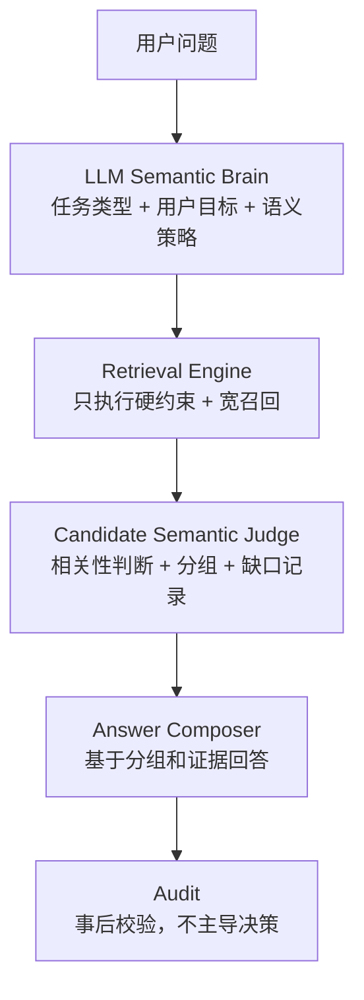

# Agent 语义大脑三批迭代技术方案

本文档记录“减少规划层、加强语义层、让 LLM 成为主语义决策层”的三批改造。当前代码已完成前三批核心链路：`SemanticStrategy` 是主语义对象，`query_plan` 是 executor 兼容输入，开放发现候选由 `CandidateSemanticJudgeTool` 做相关性判断。

具体执行清单见 [`agent-semantic-brain-tasks.md`](./agent-semantic-brain-tasks.md)，当前实现说明见 [`agent-technical-implementation.md`](./agent-technical-implementation.md)。

## 当前实现状态

| 批次 | 状态 | 当前落点 |
| --- | --- | --- |
| 批次一：并行引入语义大脑 | 已实现 | `SemanticStrategyTool` 生成语义策略，LLM 无效或不可用时走 fallback strategy |
| 批次二：开放发现迁移到语义裁判 | 已实现核心链路 | `open_discovery=true` 且 `retrieval_mode=fuzzy` 时，候选排序阶段接入 `CandidateSemanticJudgeTool` |
| 批次三：收敛旧规划链 | 已实现核心链路 | `SemanticStrategy` 成为主语义对象，`query_plan` 降级为 executor 兼容输入，`tool_plan` 使用 `SemanticStrategy -> ToolPolicy` 映射 |

保留边界：

- `executor`、`ranking`、`answer`、`audit` 继续保留。
- `query_plan` 仍兼容旧检索工具、前端 evidence 和 audit，但不再是语义中心。
- `query_diagnosis` 主要服务前端解释、调试和审计。
- candidate judge 的 `gaps` 当前用于 evidence 和回答提示，没有独立 `result_gap_analyzer.py` 补查循环。
- audit 是事后质检，不主导检索策略。

## 目标架构



核心原则：

- LLM 是语义大脑，规则是护栏。
- 硬过滤必须来自用户明确表达。
- 开放问题先宽召回，再由 LLM 判断相关性。
- memory 是提示，不是命令。
- audit 是质检，不是司机。

## `SemanticStrategy` 合同

```json
{
  "task_type": "open_discovery",
  "user_goal": "找到适合在 Skyrim 中扮演 bimbo 的 MOD",
  "strategy": "broad_then_judge",
  "hard_filters": {
    "game": "skyrimspecialedition"
  },
  "core_terms": ["bimbo", "roleplay"],
  "soft_signals": ["bimbofication", "body preset", "follower"],
  "ranking_goal": "优先推荐真正支持玩法、角色扮演、外观配套或追随者体验的 MOD",
  "answer_shape": "grouped_recommendation"
}
```

| 对象 | 职责 |
| --- | --- |
| `SemanticStrategy` | LLM/fallback 语义大脑输出，描述用户目标、策略、硬约束、软信号和回答形态 |
| `query_plan` | 兼容旧工具的执行参数，承接 executor 所需字段 |
| `ToolPolicy` | `SemanticStrategy -> tools` 的固定映射 |
| `audit` | 事后检查回答和证据一致性，不决定怎么查 |

## 批次一：并行引入语义大脑

落地模块：

```text
backend/app/services/agent/semantic_brain/
  semantic_strategy_schema.py
  semantic_strategy_prompt.py
  semantic_strategy_tool.py
  semantic_strategy_adapter.py
```

当前行为：

1. `TaskUnderstandingTool` 调用 `SemanticStrategyTool`。
2. LLM 可用时生成结构化 `SemanticStrategy`；无效 JSON 会请求修复。
3. LLM 不可用、关闭或失败时走确定性 fallback。
4. `semantic_strategy_adapter` 把策略投影到 executor 兼容 `query_plan`。
5. strategy evidence 暴露到 understanding、audit 和 graph state。

回滚/降级：

```text
MW_AGENT_SEMANTIC_STRATEGY_ENABLED=false
```

关闭后不再调用 LLM 语义策略，转为确定性 fallback。当前代码没有保留 `MW_AGENT_SEMANTIC_STRATEGY_PRIMARY` 阶段性回滚开关。

## 批次二：开放发现迁移到语义裁判

落地模块：

```text
backend/app/services/agent/judging/
  candidate_semantic_judge.py
  candidate_semantic_judge_prompt.py
backend/app/services/agent/planning/open_discovery_policy.py
backend/app/services/agent/tools/candidate_ranking_tool.py
```

当前行为：

1. `open_discovery + broad_then_judge` 使用更宽的候选池。
2. `CandidateRankingTool` 在 LLM 可用时调用 `CandidateSemanticJudgeTool`。
3. judge 输出 `high | medium | low | reject`、group、reason、gaps。
4. reject 候选从最终排序中剔除。
5. LLM 不可用或关闭时保留确定性排序路径。
6. `gaps` 记录到 evidence，用于解释和后续改进；当前没有独立补查循环模块。

回滚/降级：

```text
MW_AGENT_CANDIDATE_SEMANTIC_JUDGE_ENABLED=false
```

## 批次三：收敛旧规划链

当前职责分配：

| 旧模块 | 当前职责 |
| --- | --- |
| `query_diagnosis.py` | 解释层：公开展示 strategy、confidence、missing info、why this strategy |
| `tool_planner.py` | `SemanticStrategy -> ToolPolicy` 映射，保留工具白名单和降级 evidence |
| `context_plan_merge.py` / `executor_query_plan.py` | 保留 query_plan 兼容转换，承接执行层字段 |
| `context_inheritance_*` | 只在低信息追问、无冲突时提供上下文提示 |
| `slot_*` | soft signal extractor，不主导开放发现硬过滤 |
| `audit_service.py` | 事后校验回答和证据一致性 |

## 验证建议

```powershell
cd backend
python scripts/run_agent_quality_gate.py
python -m pytest app/tests/test_agent_runtime_graph.py
python -m pytest app/tests/test_agent_tool_planner_executor.py
python -m pytest app/tests/test_agent_context_memory_selection.py
python -m pytest app/tests/test_routes_agent_chat_context.py
python -m pytest app/tests/test_agent_semantic_strategy_tool.py
python -m pytest app/tests/test_agent_candidate_semantic_judge_tool.py
```

