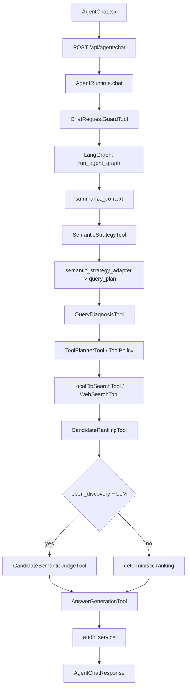

# Agent 模块技术实现文档

本文档以当前代码工作树为准，说明 `backend/app/services/agent/` 的现有请求链路、模块边界、数据契约和可审计 evidence。语义大脑改造的演进记录与任务拆解见 [`agent-semantic-brain-iteration-plan.md`](./agent-semantic-brain-iteration-plan.md) 和 [`agent-semantic-brain-tasks.md`](./agent-semantic-brain-tasks.md)。

## 设计目标

Agent 模块不是把用户输入映射成固定规则表，而是用 LLM 和上下文能力完成语义理解，再用受控工具完成检索、排序、回答和审计。

核心约束：

- LLM 可以参与理解、候选裁判和表达，但不能绕过硬过滤、工具白名单、外部来源限制和 API 契约。
- 当前问题优先；history、memory 和长期偏好只做补全或软信号，不能覆盖本轮明确输入。
- 开放发现问题优先宽召回，再由 candidate semantic judge 判断相关性、分组和 reject。
- `query_plan` 保留为 executor 兼容输入；主语义对象是 `SemanticStrategy`。
- audit 是事后校验，不反向改写检索策略。

## 目录边界

当前 Agent 相关模块主要位于：

```text
backend/app/api/routes_agent.py
backend/app/services/agent/
  chat_service.py
  runtime.py
  schemas.py
  workflows/
  context/
  planning/
  semantic_brain/
  judging/
  tools/
  memory/
  ranking/
  reflection/
  retrievers/
  quality/
  tracing/
frontend/src/api/agent.ts
frontend/src/pages/AgentChat.tsx
```

| 模块 | 职责 |
| --- | --- |
| `api/routes_agent.py` | HTTP 入口，处理 FastAPI 路由、日志和依赖注入 |
| `chat_service.py` | 兼容入口，转发到 `AgentRuntime` |
| `runtime.py` | 请求级运行时，生成 `evidence_id`，选择 chat/detail 路径，调用 LangGraph |
| `workflows/` | LangGraph 状态图和阶段函数 |
| `context/` | 多轮上下文摘要、活跃约束、上一轮查询上下文 |
| `planning/` | executor 兼容计划、上下文继承、工具策略、语义信号和约束合并 |
| `semantic_brain/` | `SemanticStrategy` schema、prompt、LLM/fallback 策略生成和 executor 兼容转换 |
| `judging/` | 开放发现候选的 LLM 语义裁判、分组、reject、gaps 和 evidence |
| `tools/` | 可独立执行的能力单元，例如查询理解、本地检索、web 检索、候选排序、回答生成 |
| `memory/` | 长期偏好、收藏画像、记忆证据和当前轮写回 |
| `ranking/` | 结果融合和排序能力 |
| `retrievers/` | SQLite FTS 等本地召回能力 |
| `reflection/` | audit 构建、回答证据补全、一致性保护 |
| `quality/` | Agent 质量门和 E2E 语义回归 |
| `tracing/` | 图节点和工具执行 trace |

## 对外 API

### `/api/agent/chat`

普通聊天入口。请求体是 `AgentChatRequest`，包含 `message`、`history`、可选模型覆盖参数等字段。

处理链路：

1. 路由层记录请求开始、耗时、结果数量和是否使用 LLM。
2. `AgentService.chat()` 转给 `AgentRuntime.chat()`。
3. `AgentRuntime` 判断是否是详情问题；如果不是，先执行请求 guard。
4. 请求进入 LangGraph 主图。
5. 图执行完成后，`finalize_chat_response()` 补齐 evidence、audit 和 memory writeback。

### `/api/agent/mod-detail`

详情问答入口。请求体是 `AgentModDetailRequest`，包含 `mod_id`、可选问题、历史消息和模型覆盖参数。

该路径复用同一个 LangGraph，但在 `summarize_context` 后直接进入详情回答，不走普通搜索、排序和通用回答生成链路。

### 会话状态接口

`/api/agent/conversation-state` 和 `/api/agent/conversation/new` 由 `conversation_service` 管理，用于前端保存用户可见的对话消息、结果卡片和 active session。LangGraph 状态不是用户会话事实源。

## 主流程

普通 chat 请求按“语义策略 -> executor 兼容计划 -> 工具检索 -> 候选语义裁判 -> 回答生成 -> audit 事后检查”的顺序执行。LLM 可以参与理解、候选裁判和自然语言表达，但每一步都要落回受控的数据结构和工具边界。



## 核心数据契约

| 对象 | 职责 |
| --- | --- |
| `SemanticStrategy` | 当前主语义对象，描述 task type、用户目标、hard filters、core terms、soft signals、ranking goal 和 answer shape |
| `query_plan` | executor 兼容输入，承载旧工具仍需要的 keywords、source/game、retrieval mode 等字段 |
| `ToolPolicy` | `SemanticStrategy -> tool capability` 的固定映射，不重新解释用户语义 |
| `AgentModMatch` | 检索和排序后的候选结果 |
| `AgentAudit` | 事后校验回答、证据、来源、约束和 memory 冲突 |

## 运行开关

当前相关开关：

```text
MW_AGENT_SEMANTIC_STRATEGY_ENABLED=true
MW_AGENT_CANDIDATE_SEMANTIC_JUDGE_ENABLED=true
```

关闭 `MW_AGENT_SEMANTIC_STRATEGY_ENABLED` 后，`SemanticStrategyTool` 走确定性 fallback；`SemanticStrategy` 仍会作为 executor 兼容计划的一部分存在。关闭 `MW_AGENT_CANDIDATE_SEMANTIC_JUDGE_ENABLED` 后，开放发现候选保留确定性排序路径。

## 验证

常用回归命令：

```powershell
cd backend
python -m pytest app/tests/test_agent_semantic_strategy_tool.py
python -m pytest app/tests/test_agent_candidate_semantic_judge_tool.py
python -m pytest app/tests/test_agent_tool_planner_executor.py
python -m pytest app/tests/test_agent_runtime_graph.py
python scripts/run_agent_quality_gate.py
```

